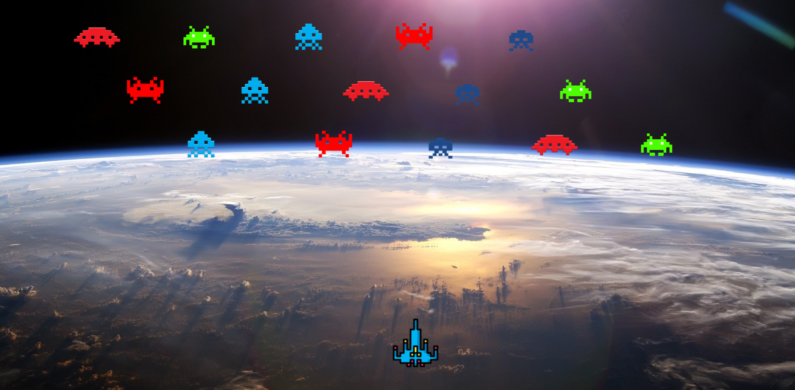

# iseseisev-projekt

Autor: Henri Mägi

Projektiks valisin Space-Invaders mängu.

Mäng sisaldab endas tulnukaid ja kosmoselaeva mis saavad omavahel suhelda. Mängu alguses hakkavad tulnukad liikuma ekraani alumise osa poole. Laev saab ringi liikuda ja vajutades vastavat nuppu "laseb" välja raketi. Kui rakett puutub kokku tulnukaga siis mõlemad
kaotatakse ära. Mäng on kaotatud kui tulnukad jõuavad ekraani alumisse ossa.

Inspiratsiooniks vaadati youtube videot: https://www.youtube.com/watch?v=XmqAPQsc1n4

Kuigi sealt koodi ei kopeeritud.

