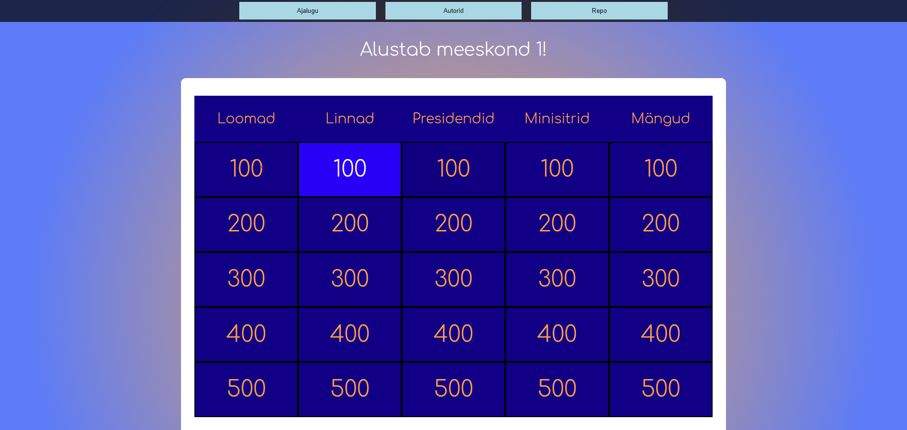

# Kuldvillak
Kuldvillaku loojad: Rene Raidmaa ja Ralf Vihmaru

## Funktsionaalsused
* Loodud on Kuldvillaku mäng, kus on võimalik 2 tiimi vahel mängida valikvastustega teadmiste mäng.
* Mäng loeb punkte ja lisab need tiimi skoorile automaatselt. Lisaks on ka reset nupp, mis tühjendab tiimi punktid nulli.
* Leheküljel on ka ajaloo funktsionaalsus, kus on võimalik näha eelmiste mängude võitjaid.
* Mängule on lisatud ka muusika, mis mängibb küsimuse vastust mõeldes ning heliefektid õige ja vale vastuse korral.

