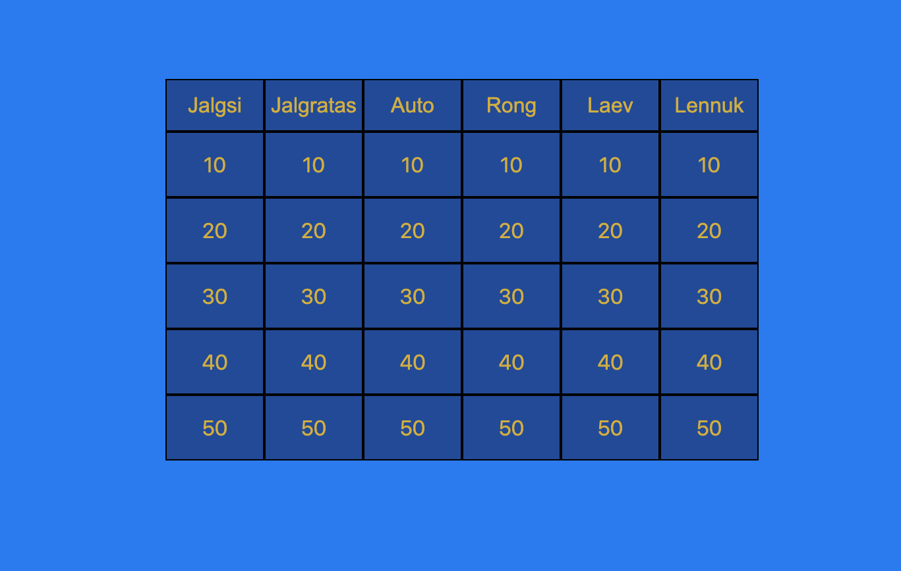

Iseseisev töö  - KULDVILLAK

Autor: Urmas Kirsipuu

Veebipõhine mäng desktop tüüpi arvutile(mobiilil on ruudud liiga väikesed)

Koosneb 6 kategooriast ja 5 vastusevõimalusest, kokku 30 küsimust.

Vastata saab etteantud aja jooksul, vastust muuta ei saa. Kui vastust ettenähtud aja jooksul ei valitud, siis muutub küsimus mitteaktiivseks.

Vastamisel näidatakse jooksvat punktiskoori.

Lisatud on õige ja vale vastuse helid ning aja ületamise heli.

Mäng on mõeldud ühele inimesele.

Rakenduse aadress http://greeny.cs.tlu.ee/~punkel/veebiprogrammeerimine/Kuld/kuldvillak.php

