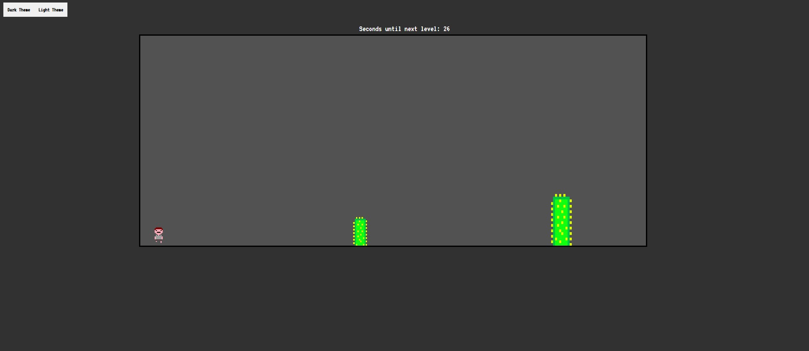

Jump and run mäng

Tegu on 2d jump and run mänguga. Takistused liiguvad järjest mängija poole ning mängija saab ülemise nooleklahviga üle takistuste hüpata ja parema nooleklahviga õhus olles edasi dashida.

Programm tekitab piirsuuruseid arvestades jooksvalt erinevate suurustega takistusi. Mängus on kolm levelit ning iga leveliga hakkavad takistused kiiremini ja väiksemate vahedega ilmuma. Iga level kestab 30 sekundit ja sekundeid järgmiste leveliteni loeb mänguakna kohal loendur. Mänguskoori arvestatakse kui tervet mängitud aega sekundites.

Mängul on light mode ja dark mode

Kasutasime järgmisest videost mõned read koodi, et dashimisel tekkiv takistuste x positsiooni muutus tuleks sujuvam

\
\

