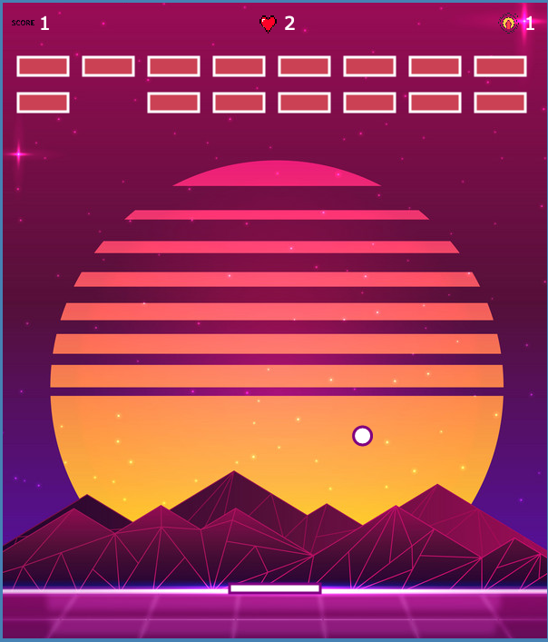

# 2D BRICKBREAKER

### Autorid: Tauri Miilits, Karl-Markus Pihlakas

* Tegemist on Breakout stiilis 2D mänguga, kus mängijal tuleb palliga purustada kõik tellised. Pall muutub mängu vältel kiiremaks ning iga leveli läbides tekib uus rida telliseid. Level läbitakse täpsemalt, kui kõik tellised antud levelil on purustatud. Maksimaalselt on kolm levelit, kolme leveli läbides saab kasutaja teate "YOU WIN". Mängijal on kolm elu ning elude lõppedes on mäng läbi ning kasutaja saab teate "Game Over", mõlemal juhul on mängijal võimalik mängu uuesti alustada.  

Mängu loomisel on abi saadud: 
* https://www.youtube.com/watch?v=FyZ4_T0GZ1U
* https://www.youtube.com/watch?v=opA9Tc-cqgc
