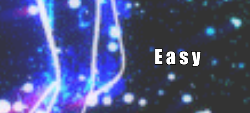

# Type-Type-Mania kirjutamis mäng
PROJEKTI LOOJAD :
HERMAN PETROV JA DANIEL EELMAA
##
# PROJEKTI KIRJELDUS:
"Type-Type-Mania" on sõnade trükkimis mäng. Millel on olemas 3 erinevat mängu raskust millel on erinevad taust ja muusika ning sõnade valik, skooritabel mis võimaldab sortimist vastavalt kasutaja raskus soovile. Lisaks, mängul on loodud selgitus tab kus saab siis rohkem infot mängu raskuste kohta. Ja mäng suudab teavitada kui kasutaja on ületanud parima skoori. 
## Lisa
Mäng on mõeldud desktopi jaoks ning ei olnud võetud mingeid õpetus videosi. Kood on iseseisvalt kirjutatud ning läks iga liikme kohta umbes 83 tundi.
## Projekti link
http://www.tlu.ee/~hp355837/Projekt/
##
# Detailsem kirjeldus ja funktsionaalsus
# Peamenüü
Lehe avades leiab kasutaja end peamenüüs kus on kirjutatud projekti loojad ja projekti nimi "Type-Type-Mania". Menus  saab valida nelja valiku vahel: mängu õpetus, mäng ja skooridetabel ning mängu projekti repositooriumi nupp.
##

##
## Õpetus ( Explanation of Game)
Vajutades õpetuse peale jõuab kasutaja mängu selgitus lehele kus  on piltitidega õpetus mängu alustamiseks ning selgituses  kolmest erinevast mängu koormusesest mida kasutaja saab valida. Tagasi navigeerida saab vajutades Õpetus lehel oleva "BACK TO MENU" nuppuga.
##

##
# Mängu menu
## Mängu menu-kirjeldus 1
Mängu sisenemiseks vajab kasutaja eelnevalt vajutada Menu "Play Game" nuppu peale kus saab siis kasutaja põhi mängu osale ligi.
Mängus näeb kasutaja tagasi menu nupu, nime sisestus koha, raskuse valiku nupe, heli seadistus riba, start nupp ja teavitus kuidas mängu mängitakse. 

## Mängu menu-kirjeldus 2
Mängul peaks kasutaja algul sisteama nime kui nimi pole antud ja kasutaja otsustab ikkagist mängida siis mängu leht teavitab, et kasutaja nimi hakkab olema anonüümne ehk "Anonymous".

## Mängu menu-kirjeldus 3
Kasutaja peab valima raskus taseme ilma milleta mäng keeldub mängimist ning teavitab kasutajat kui tal pole raskus valitud.
## Mängu menu-kirjeldus 4
Mängijal on võimalus valida eelnevalt enda heli kas ta soovib muusikat kuulda või mitte. 
## Mängu menu-kirjeldus 5
Peale nime lahtri sammu ning valides enda raskus taseme, jõuab kasutaja stardi nuppuni kus kasutajala teavitatakse, et mäng toimub vaid nuppud vajutustega klaviatuuril ning kui peale starti vajutamist on kasutaja vajutanud lehest eemal näiteks desktopi peale siis tasub kasutajal uuesti vajutada lehe peale, et mäng registreeriks nupu vajutusi.
Peale start nuppu vajutus, vastavalt mängija raskuse valikul algab mäng. 
##

##
# Mäng
## Mängu hindamis süsteem ehk skoor
Mäng hindab kasutaja sisestatud tähed. Iga täht tähendab punkti. Punkti suurus oleneb raskusest. Kui kasutaja täidab kõik tähed sõnas õigesti ära annab mäng valminud sõna eest vaid punkte. Ehk kui sõna "good" ilmub ning valitud tase on Easy siis iga täht annab 1p ja  vaid kirjutades kõik tähed välja saab kasutaja enda 4 punkti kätte. 

Kui kasutaja suudab 6 järjestiku sõna õigesti kirjutada siis tema järgnevad sõnadest tulevad punktid korrutatakse kahega. Ning 15 järjestiku sõna puhul korrutatakse iga järgnev sõna kolme kordselt. 

Kuid erinevatel raskus tasemetel on olemas ka karistus punktid iga valesti sisestatud tähe eest.
Detailsemalt järgnevalt:

## Mängu raskus-Easy (Lihtne)
Mängul on olemas kokku kolm raskust ning esimene on Easy ehk lihtne ning lihtsas mängus valikus saab kasutaja teha nii palju vigu kui tahab ja ei pea muretsema, et mäng läheb kinni peale mitmeid valeid tähti. 
Lihtsa mängu raskusel on iga õigesti sisestatud täht 1 punkt. 
Mängu kestvus on 62 sekundit.
##

##
## Mängu raskus-Normal (Normaalne)
Normal on teine raskus tase mängus ning kasutaja iga sisestatud täht sõnas tähendab 2 punkti. Ning iga vale sisestatud täht tähendab -5 punkti kohe mängija punktidest
Mängu kestvus on 63 sekundit.
##

##
## Mängu raskus-Hard (Raske)
Mängu raskus hard ehk raske on kolmas ja viimane raskus tase valik mängus kus kasutaja iga õige täht sõnas tähendab juba 3 punkti. Kasutaja vale tähe sisestusel on kohe -10 punkti mängija punktidest. Lisaks mängija saab teha vaid 3 viga kus 4 viga automaatselt lõpetab mängu ära ja salvestab vaid viimase saavutatud skoori tulemuste tabelisse. 
Mängu kestvus on 54 sekundit. Kui mängija sisetab neljandat korda valet tähte siis mäng lõpeb ja suunatakse mängija Scoreboardile kus teavitatakse teda tema mitmest veast ja ta lõplik tulemus salvestatakse scoreboardi. 
##

##
# Gameplay ehk mängimine
## Enne Countdown-i
Peale Start nupu vajutamist jõuab mängija põhi mängu. Taust vahetub ning muusika ka. Algul on mängijal 5 sekundit valmistuda ette. Kasutaja saab veel kord reguleerida enda heli ning näeb enda valitud raskus taseme ja on teavitatud kus sõnad hakkavad ilmuma
##

##
## Peale Countdown-i
Kasutajale on paremal antud mängu aeg ja vasakul tema skoori punktid. Lisaks kui kasutaja loobub enda mängust siis ta võib vajutada Quit Game. Mängus iga õigesti kirjutatud täht muutub lillast valgeks. Ning boonuste puhul tuleb boonuse aken juurde. Kui aeg saab otsa, kasutaja vajutab "Quit Game" või kasutaja kaotab mängu Hardi peal siis suunab mäng koheselt kasutaja Scoreboardile edasi kus ta näeb enda just mängitud mängus saavutatud tulemuse. Kui mängija tulemus ületab tulemuste tabeli parima mida hinnatakse kõikidest raskustest siis teavitatakse mängijat sellest ning tagaplaanil käib muusika "You're the best". 
##

##
# Scoreboard tulemuste tabel
Scoreboard on mõeldud tulemust järgimiseks mängus. Kõik tulemused on salvestatud kasutaja olevas brauseris localstorage-s. Ning võimaldab jälgida enda tulemusi erinevatel raskustel. 
## Scoreboard menu
Scoreboardis on olemas nupp minna tagasi Pea menus, nupud tabeli sorteerimiseks vastavalt raskusele. Tabeli tulemused on järjestatud järjekorras nimi, tase ja tulemus. Esmakords scoreboardi külastusel teavitab leht tulemuste puudumisest. Järgnevalt peale mängimist näeb kasutaja minnes scoreboardile kõik tulemused ning selleks, et näha enda soovitud taseme tulemust siis saab valida vastava nupu abil "Easy", "Normal","Hard".  Kui kasutaja on mänginud näiteks vaid "Hardi" siis minnes "Normal" või "Easy" peale on teavitatud kasutajat nende mängu väärtuste puudumisest kuna kasutaja pole veel mänginud nende raskus tasemetel.  
##

##
## Scoreboard peale mängimist
Peale mängimist on alati viidud mängija kohe Scoreboardi juurde kus ta näeb kõik tulemused "Easy" kuni "Hard" ning ka enda just saavutatud mängu tulemust. Lisaks peale mängu on ka tabeli all sõnum mis skoori on mängija saanud ja ületades kõrgeima tulemus on ta ka sellest teavitatud sõnumiga. 
##

##

